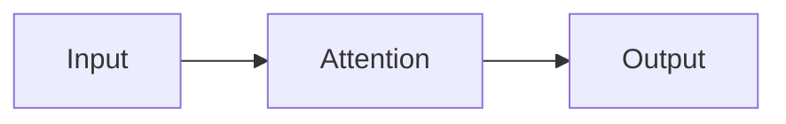

# Writing posts

Posts are Markdown or MDX files in `src/content/posts/`. The file name determines
the URL, so name files with lowercase words separated by hyphens.

## Creating a post

```yaml
---
title: "Scaled Dot-Product Attention, Step by Step"
pubDatetime: 2026-10-01T19:00:00-07:00
description: "A worked walkthrough of scaled dot-product attention with a minimal PyTorch implementation."
tags: ["transformers", "attention", "math"]
featured: false
draft: false
---
```

Only `title`, `pubDatetime`, and `description` are required. Always include a
timezone offset such as `-07:00`, otherwise the date is read as UTC.

If you use Visual Studio Code, type `template` in a Markdown file to insert a post
skeleton from `.vscode/blog.code-snippets`.

## Frontmatter reference

| Field          | Type     | Required | Description                                                                |
| -------------- | -------- | -------- | -------------------------------------------------------------------------- |
| `title`        | string   | Yes      | Post title, used in the browser tab, cards, the feed, and social previews. |
| `description`  | string   | Yes      | One or two sentences for search results and summaries.                     |
| `pubDatetime`  | date     | Yes      | Publication timestamp as an ISO 8601 string with an offset.                |
| `modDatetime`  | date     | No       | Last update. When later than `pubDatetime`, an "Updated" label appears.    |
| `tags`         | string[] | No       | Topic labels. Defaults to `["others"]`. Each tag gets its own page.        |
| `featured`     | boolean  | No       | Pins the post to the top of the home page.                                 |
| `draft`        | boolean  | No       | Excludes the post from every build.                                        |
| `author`       | string   | No       | Defaults to the site author.                                               |
| `ogImage`      | image    | No       | Overrides the generated social preview image.                              |
| `canonicalURL` | string   | No       | Set when the post was first published elsewhere.                           |
| `hideEditPost` | boolean  | No       | Hides the "Edit page" link for this post.                                  |
| `timezone`     | string   | No       | Overrides the display timezone for this post's dates.                      |

## URLs, drafts, and scheduling

| File                                    | URL                        |
| --------------------------------------- | -------------------------- |
| `src/content/posts/attention.md`        | `/posts/attention/`        |
| `src/content/posts/papers/attention.md` | `/posts/papers/attention/` |

Subdirectories become path segments, and a file or directory starting with an
underscore is ignored. `draft: true` removes a post from builds. A `pubDatetime`
in the future keeps a post out of the production build until that time, while the
development server still shows it for previewing.

The home page and post list sort by `modDatetime` when present, otherwise by
`pubDatetime`, newest first.

## Table of contents

Add a level-two heading with the exact text `Table of contents` where you want the
list to appear:

```markdown
## Table of contents
```

The heading is replaced by a generated list of the post's headings, collapsed
into a disclosure element.

## Mathematics

Mathematics renders to HTML at build time with KaTeX, so there is no client-side
math script. Inline math uses single dollar signs and display math uses double
dollar signs.

```markdown
The scaling factor is $\sqrt{d_k}$.

$$
\text{Attention}(Q, K, V)
= \text{softmax}\!\left(\frac{QK^\top}{\sqrt{d_k}}\right) V
$$
```

Escape a literal dollar sign as `\$`. Display equations wider than the column
scroll horizontally.

## Code

Fence code with a language for highlighting. Add `file=` to show a file name
header.

````markdown
```python file=attention.py
scores = query @ key.transpose(-2, -1)
```
````

Shiki notation comments control emphasis, using the comment syntax of the
language.

| Notation             | Effect                                              |
| -------------------- | --------------------------------------------------- |
| `[!code highlight]`  | Highlights the line.                                |
| `[!code ++]`         | Marks the line as added, with a green background.   |
| `[!code --]`         | Marks the line as removed, with a red background.   |
| `[!code word:token]` | Highlights every occurrence of `token` on the line. |

The notation comment is removed from the rendered output.

## Diagrams

Fence a diagram with `mermaid`. Diagrams render in the browser and follow the
light and dark theme.

````markdown

````

Flowcharts, sequence diagrams, class diagrams, state diagrams, entity
relationship diagrams, Gantt charts, and timelines are supported. See the
[Mermaid documentation](https://mermaid.js.org/intro/) for syntax.

## Callouts

Callouts use the Obsidian blockquote syntax.

```markdown
> [!NOTE]
> Useful context.

> [!WARNING] A custom title
> Something that can go wrong.
```

Common types are `NOTE`, `TIP`, `IMPORTANT`, `WARNING`, `CAUTION`, `INFO`,
`SUCCESS`, `QUESTION`, `EXAMPLE`, and `QUOTE`. Append `-` to start a callout
collapsed, or `+` to start it open.

## Images

**Relative to the post.** Place the image beside the post and reference it
relatively. Astro optimizes it and converts it to a modern format.

```markdown

```

**In `public/`.** Files there are copied to the site root unchanged. Reference
them with an absolute path. This skips optimization, which suits files that are
already compressed.

```markdown

```

A path such as `/src/assets/images/foo.png` will not resolve in Markdown.

## Publishing checklist

1. Give the post a clear `title` and `description`, and set `draft: false`.
2. Run `npm run build` and check for errors.
3. Run `npm run preview` and read the post at
   `http://localhost:4321/posts/<slug>/`, including any math and diagrams.
4. Commit and push to `main`.
