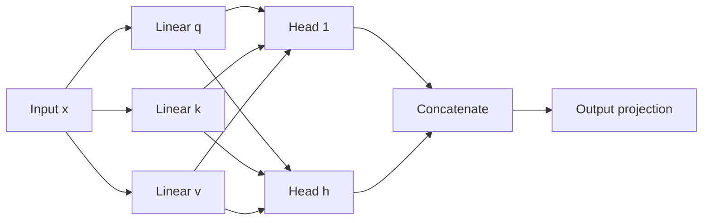

Attention is the operation that lets a model look at every position in a sequence while building the representation for one position. This post works through the scaled dot-product variant used in the original transformer, from the motivation to a runnable implementation.

Everything below renders from plain Markdown, so it doubles as a tour of the writing features enabled on this site: math, highlighting, callouts, tables, and diagrams.

## Table of contents

## The problem attention solves

A recurrent network compresses the past into a single hidden state. That state has fixed size, so the amount of past information it can carry is bounded, and the compression is lossy. Attention takes a different approach: instead of summarizing the past into one vector, it keeps the full set of past representations and lets the model decide how much to read from each one.

Concretely, for each position we compute a weighted average over all positions, where the weights depend on the current position. The weights are not fixed parameters. They are computed on the fly from the data, which is what makes the operation dynamic.

## Queries, keys, and values

The operation uses three projections of the input:

- A **query** $q$ describing what the current position is looking for.
- A set of **keys** $k_j$ describing what each position offers.
- A set of **values** $v_j$ holding the content that gets mixed.

The compatibility between a query and a key is their dot product. A large positive dot product means the query and key point in similar directions, so that position should contribute more. The weights then normalize with a softmax, and the output is the weighted sum of the values.

## The formula

For a query matrix $Q \in \mathbb{R}^{T_q \times d_k}$, a key matrix $K \in \mathbb{R}^{T_k \times d_k}$, and a value matrix $V \in \mathbb{R}^{T_k \times d_v}$:

$$
\text{Attention}(Q, K, V)
= \text{softmax}\!\left(\frac{QK^\top}{\sqrt{d_k}}\right) V
$$

Read left to right, the score matrix $QK^\top$ has shape $T_q \times T_k$ and holds one raw score per query-key pair. Dividing by $\sqrt{d_k}$ rescales the scores, the row-wise softmax turns each row into a probability distribution, and multiplying by $V$ mixes the values. The output has shape $T_q \times d_v$.

## Why divide by the square root of the key dimension

The scaling factor is not cosmetic. Suppose the components of $q$ and $k$ are independent with mean $0$ and variance $1$. Their dot product is

$$
q \cdot k = \sum_{i=1}^{d_k} q_i k_i
$$

Each term has mean $0$ and variance $1$, and the terms are independent, so the sum has mean $0$ and variance $d_k$. The standard deviation therefore grows like $\sqrt{d_k}$.

Without rescaling, large dimensions produce large-magnitude scores. A softmax over large scores approaches a one-hot vector, so most of the gradient signal disappears and learning stalls. Dividing by $\sqrt{d_k}$ restores unit variance and keeps the distribution in a range where the softmax stays responsive.

> [!NOTE]
> The argument assumes roughly unit-variance, uncorrelated features. Pre-layer-norm or weight-normalized projections make this assumption closer to true, which is part of why those techniques stabilize transformers.

## A small numerical example

Take $d_k = 2$, one query, and three keys:

$$
q = \begin{bmatrix} 1 \\ 0 \end{bmatrix}, \quad
k_1 = \begin{bmatrix} 1 \\ 0 \end{bmatrix}, \quad
k_2 = \begin{bmatrix} 0 \\ 1 \end{bmatrix}, \quad
k_3 = \begin{bmatrix} 1 \\ 1 \end{bmatrix}
$$

The raw scores are $q \cdot k_1 = 1$, $q \cdot k_2 = 0$, and $q \cdot k_3 = 1$. Dividing by $\sqrt{2} \approx 1.4142$ gives scores of $0.7071$, $0$, and $0.7071$. Exponentiating and normalizing yields the weights in the table below.

| Position | Raw score | Scaled score |  Weight | Value $v_j$ | Weighted value   |
| -------- | --------: | -----------: | ------: | ----------- | ---------------- |
| 1        |         1 |       0.7071 | 0.40111 | $[1, 0]$    | $[0.401, 0]$     |
| 2        |         0 |       0.0000 | 0.19779 | $[0, 1]$    | $[0, 0.198]$     |
| 3        |         1 |       0.7071 | 0.40111 | $[1, 1]$    | $[0.401, 0.401]$ |

Summing the last column gives the output:

$$
\text{output} \approx \begin{bmatrix} 0.802 \\ 0.599 \end{bmatrix}
$$

Positions 1 and 3 get equal weight because they have the same score, and position 2 still receives about one fifth of the mass. That is the softmax behavior we want: a preference among candidates, not a hard selection.

## A minimal implementation

The whole operation is a few lines of PyTorch.

```python file=attention.py
import math

import torch
import torch.nn.functional as F


def scaled_dot_product_attention(
    query: torch.Tensor,
    key: torch.Tensor,
    value: torch.Tensor,
    mask: torch.Tensor | None = None,
) -> torch.Tensor:
    """Attention over the last two dimensions.

    Shapes: query (..., T_q, d_k), key (..., T_k, d_k), value (..., T_k, d_v).
    """
    d_k = query.size(-1)

    # Raw compatibility scores, rescaled for numerical stability.
    scores = query @ key.transpose(-2, -1) / math.sqrt(d_k)  # (..., T_q, T_k)

    if mask is not None:
        scores = scores.masked_fill(mask == 0, float("-inf"))

    weights = F.softmax(scores, dim=-1)  # rows sum to one
    return weights @ value  # (..., T_q, d_v)
```

Notice that the function is shape-agnostic. It operates on the last two dimensions and broadcasts over the leading ones, so the same code handles a single sequence, a batch, or a batch of heads.

## Masking

Two kinds of masking show up in practice. **Padding masks** hide the positions that exist only to pad a batch to a common length. **Causal masks** prevent a decoder position from reading the future.

A causal mask is a lower-triangular boolean matrix:

```python
def causal_mask(length: int) -> torch.Tensor:
    return torch.tril(torch.ones(length, length, dtype=torch.bool))
```

Passing it to the function above sets the upper triangle to negative infinity before the softmax, so those positions receive exactly zero weight.

> [!WARNING]
> Use `float("-inf")` rather than a large finite negative number when you can. A finite value such as `-1e9` still has a nonzero exponential, and a row that is entirely masked produces a uniform distribution instead of the all-zero row you likely want.

## Multi-head attention

A single attention operation averages over the value vectors with one set of weights. Multi-head attention runs several of these operations in parallel on lower-dimensional projections and concatenates the results:

$$
\text{MultiHead}(X) = \text{Concat}(\text{head}_1, \dots, \text{head}_h) W_O,
\quad
\text{head}_i = \text{Attention}(XW_Q^i, XW_K^i, XW_V^i)
$$

Each head can specialize, for example one tracking syntax and another tracking long-range dependencies. The projections keep the total parameter count comparable to a single head of full width.



## Summary

- Attention computes a data-dependent weighted average over positions rather than a fixed summary.
- Scores come from query-key dot products, normalized by $\sqrt{d_k}$ to keep the softmax well conditioned.
- The output is the score-weighted sum of values, with masking to control which positions are visible.
- Multiple heads run the operation in parallel on projected subspaces and are combined by a final linear layer.

The entire mechanism is a matrix multiply, a scaling, a softmax, and another matrix multiply. Most of the engineering effort in real systems goes into doing that efficiently on hardware rather than into the math itself.
